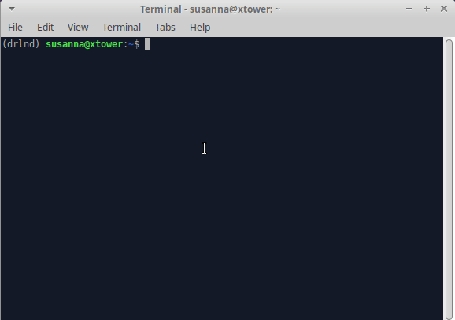
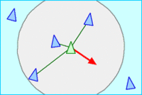

# CppND-Boids

This is my final project for the Udacity nano Degree C++ course, which I completed between May and September 2020. It is a reconstruction and extension of an existing project https://github.com/jyanar/Boids, regarding memory management, multithreading and object orientation. The choice of the task was based on the following criteria: Graphical development, swarm simulation, investigation of performance improvement through multithreading and intensive use of smart pointers. 

# Usage
After starting the application cppnd-boids opens a fullscreen in which a high number (default 1000) of sprites are shown. Each of the sprites initially represents a prey which is part of a cluster that simulates a swarm. The swarm of preys can be disturbed by adding predators. To do so, use the mouse to add a small number of predators to the simulation. By using more buttons the general behaviour of the swarm can be changed. F5 starts the simulation of new preys and with the space-key single preys are added. By pressing the M-key you can switch between multi- and single-threading. Singlethreading results in a decrease of the frame rate by a factor of 10.



Listing of the things I have introduced based on previous work:
* Support of swarm simulation by multithreading, sorting of the single boids and parallel execution of the simulation.
* Introduction of an obstacle class and further development of swarm behaviour to avoid objects.
* Replacing the vector-based representation of the swarm with sprites
* Support for configuration files based on the TOML format
* Optimization of the class structure, e.g.: relocation of class attributes to parent classes
* Unit tests for important functions of the application
...

# Requirements
I developed cppnd-boid exclusively on Ubuntu systems and can only give instructions on how to install the preconditions for libraries and build tools. 
```
apt-get install -y build-essential cmake libsfml-dev mesa-utils libgl1-mesa-glx libnvidia-gl-440 git
```
As a basis I used an Ubuntu 20.04 installation. https://releases.ubuntu.com/20.04/

## Generally described dependencies
* C++ compiler with c++17 standard
* cmake build system version greater than 3.11
* Make build system
* SFML (Simple and Fast Multimedia Library) version 2.5
* OpenGL Mesa 3D Graphics Library 
* NVIDIA drivers if appropriate GPU is available

## Docker support
I have added support for docker based development, building and execution of cppnd-boids under [docker/readme](Docker/README.MD). You could save yourself the trouble of installing the prerequisites provided that a Docker runtime environment and a network connection is available. Of course debugging with gdb under docker is not really comfortable ...

# Install
The repository must be cloned locally.  When the unittests are run, the build configuration automatically downloads googletest from github.

```
git clone https://github.com/SusannaMaria/CppND-Boids.git
cd CppND-Boids
```

# Build
The build is configured with Cmake and finally built with make. To prevent temporary artifacts like .o files from being in the main directory, the build should be executed in a subfolder.
```
mkdir build
cd build
cmake ..
make
```

# Run
The program is started without parameters and can only be configured via configuration file.
```
./cppnd-boids
```

# Control-Keys during run
The behaviour of the swarm can be influenced during runtime. The following keys can be used:
```
--------------Instructions--------------
Press 'Q' to increase Separation Amount
Press 'A' to decrease Separation Amount
Press 'W' to increase Alignment Amount
Press 'S' to decrease Alignment Amount
Press 'E' to increase Cohesion Amount
Press 'D' to decrease Cohesion Amount
Press 'I' to increase Separation Weight
Press 'J' to decrease Separation Weight
Press 'O' to increase Alignment Weight
Press 'K' to decrease Alignment Weight
Press 'P' to increase Alignment Weight
Press 'L' to decrease Alignment Weight
Press 'M' to switch between Multi und Singlethreaded
Press 'Space' to add a prey Boid in a random spot
Left Click to add a predator Boid where you clicked
Press 'F5' to restart the simulation
Press 'Esc', 'Backspace', or 'X' to Quit
```

# Configuration
Check build folder for ```boids.toml```after first time run.

## Default Config which can be adapted:
```
[boids]
version = 1.0
uistatfont = "assets/consola.ttf"
preysprite = "assets/fly16x16.png"
predsprite = "assets/fly16x16_red.png"
multithreaded = true
amountprey = 1000
desSep = 20.0
desAli = 70.0
desCoh = 25.0
sepW = 1.5
aliW = 1.0
cohW = 1.0
theta = 0.0
amountobstacles = 5
gridx = 4
gridy = 3
fontsize = 12
rootpath = <is automatically set to the installation directory at the first start.>
```

# Basics of the Boids swarm simulation (Excerpts from https://en.wikipedia.org/wiki/Boids)
Boids is the term for certain interacting objects in a computer simulation. The name comes from a groundbreaking artificial life program developed by Craig Reynolds in 1986 to simulate the swarming behaviour of birds. He referred to the simulated objects as boids. 

Boid-based models represent a form of emergent behaviour, i.e. the complexity of the model results from the interaction of the individual boids, which follow a simple set of rules.
* **Separation**: select a direction that counteracts an accumulation of boids


* **Alignment**: select a direction that corresponds to the mean direction of the neighboring boids


* **Cohesion**: choose a direction that corresponds to the middle position of the neighboring boids


* **Avoidance**: Adapt the direction to avoid hitting obstacles


# Variants of the Boids, predator and prey
This implementation of swarm simulation combines boids flocking algorithm with predator/prey dynamics. The predator has an attack behavior and the prey has another avoidance behavior.

```
in function <Separation>
...
if boid == prey
    if boid is looking at predator
        create huge separation Vector
...

in function <Cohession>
...
if boid == predator
    change direction to reduce the distance to center of neighbourhood
...
```

# Implementation
The implementation includes classes for:
* **Game**: Central component which caps the partial components and contains the central run method
* **Boid**: individual objects of the swarm
* **Flock**: Container for the objects of the swarm, sorted and divided according to their position on the grid 
* **AltpriteContainer**: Container for the representation of each boid as an individual sprite.
* **Obstacle**: Obstacle object, which implements the central implementation of the avoidance behavior for all boids.
* **ObstaclesContainer**: Simple container to generate and draw the obstacles.
* **Threadpool**: To support the multi-threading of the flocking algorithm. Each grid element is calculated in parallel.
* **BoidConfig**: Configuration of the application, reading the configuration and writing it the first time the application is started.
* **PVector**: Implements methods to use euclidian vectors.
## Class relations
Here the class relationship is shown in simplified form. 

**Remarks:**
* To make the configuration of the swarm simulation known to the single boids I decided to use a shared pointer in the boid class to the flock container as parent. 
* The configuration is held by the game class and made available to the flock as shared pointer.

